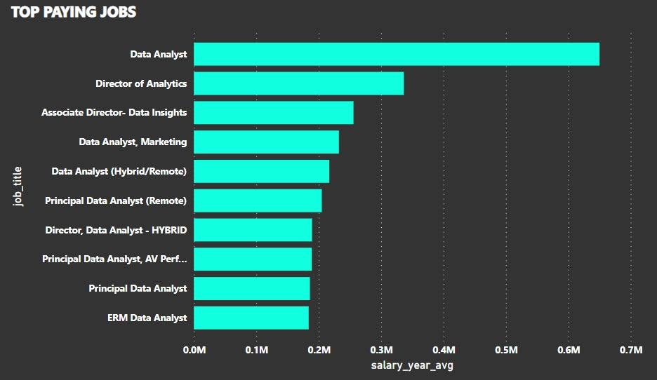
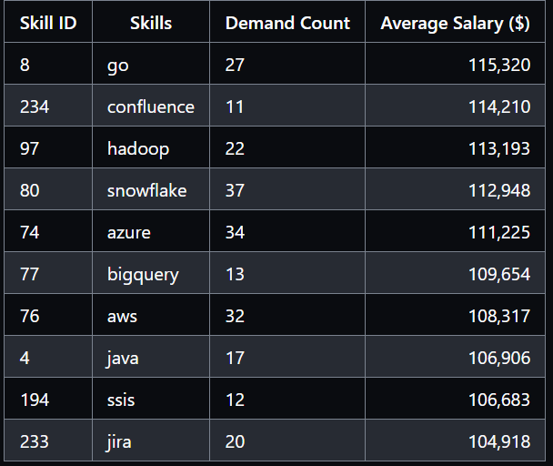

 # Introduction 
   Dive into the data job market! focusing on the data analyst role, this project explores the top paying jobs , in-demand skills and where high demand fills high salary in data analaytics.

   SQL QUERIES check them out here [Project_sqlfolder](/Project_sql/)


 # Background 
   Driven by a quest to navigate the data anlyst job market more effectively, this project explores the top paid and in demand skills streamlining others  work to find the optimal jobs 

  ## These questions I wanted to answer through my  sql queries work were: 
  1) What are the top-paying data analyst jobs
  2) What are the skills required for these  jobs?
  3) What skills are most in demand for data analyst?
  4) What skills are associated with higher salary?
  5) What are the most optimal skills to learn 
  
  # Tools I used 
  Harnessing the power of several key tools to deep dive into the data analyssi job market
  
- **SQL**: The backbone of my analysis, allowing me to query    database and unearth critical insights.
- **PostgreSql**: The chosen database management system,ideal for handling the job posting data.
- **Visual studio Code**: My go to go-to for database management and executing sql queries.
- **Git & Github**: Essential for version control and  sharing my SQl Scripts and analysis, ensuring collaborations and project tracking

 # **Analysis** : 

## **1. Top paying jobs:** 
To identify the highest paid roles I filtered the data analyst roles by average year salary and location,focusing on the remote jobs. This query identifies the highes paying oppurtunities in this field.

```sql
SELECT job_id,
       job_title,
       salary_year_avg,
       Name As Company_Name
FROM   job_postings_fact
LEFT JOIN company_dim ON job_postings_fact.company_id=company_dim.company_id
Where  job_title_short='Data Analyst' AND job_location='Anywhere' AND 
      salary_year_avg IS NOT NULL
Order BY salary_year_avg DESC
Limit 10;    
``` 
Here's the breakdown of the top data analyst jobs in 2023:

A) *Wide Salary Range* : Top 10 paying data analyst roles span from $184,000 to $650,000, indicating significant salary potential in the field.

B) *Diverse Employers*: Companies like SmartAsset, Meta, and AT&T are among those offering high salaries, showing a broad interest across different industries.
 
C) *Job Title Variety*: There's a high diversity in job titles, from Data Analyst to Director of Analytics, reflecting varied roles and specializations within data analytics.




*Bar graph visualizing the salary for the top 10 salaries for data analysts; Powerbi generated the bargraph from the data set of the resulting csv file*

## **2. Skills for Top Paying Jobs**
To understand what skills are required for the top-paying jobs, I joined the job postings with the skills data, providing insights into what employers value for high-compensation roles.

```SQL
WITH top_paying_jobs AS(
    SELECT job_id,
        job_title,
        salary_year_avg,
        Name As Company_Name
    FROM   job_postings_fact
    LEFT JOIN company_dim ON job_postings_fact.company_id=company_dim.company_id
    Where  job_title_short='Data Analyst' AND 
        salary_year_avg IS NOT NULL
    Order BY salary_year_avg DESC
    Limit 10
    )

    Select top_paying_jobs.*,skills
    From top_paying_jobs
    INNER JOIN  skills_job_dim ON top_paying_jobs.job_id=skills_job_dim.job_id
    INNER JOIN skills_dim ON  skills_job_dim.skill_id=skills_dim.skill_id 
    ORDER BY salary_year_avg DESC
```
Here's the breakdown of the most demanded skills for the top 10 highest paying data analyst jobs in 2023:

 - **SQL** is leading with a bold count of 8.
 - **Python** follows closely with a bold count of 7.
 - **Tableau** is also highly sought after, with a bold count of 6. 
 - **Other skills** like R, Snowflake, Pandas, and Exce
 
 l show varying degrees of demand. 
 
 *Bar graph visualizing the count of skills for the top 10 paying jobs for data analysts; PowerBi generated this graph from my SQL query results*
 
 ## **3.In-Demand Skills for Data Analysts**
This query helped identify the skills most frequently requested in job postings, directing focus to areas with high demand.**

```sql

    Select skills,count(skills) AS demand_count
    From job_postings_fact
    INNER JOIN  skills_job_dim ON job_postings_fact.job_id=skills_job_dim.job_id
    INNER JOIN skills_dim ON  skills_job_dim.skill_id=skills_dim.skill_id
    Where job_title_short ='Data Analyst' and job_work_from_home= TRUE
    group by skills
    ORDER BY demand_count DESC
    Limit 5
```

 Here's the breakdown of the most demanded skills for data analysts in 2023

- **SQL and Excel** remain fundamental, emphasizing the need for strong foundational skills in data processing and spreadsheet manipulation.

- **Programming and Visualization Tools**  like Python, Tableau, and Power BI are essential, pointing towards the increasing importance of technical skills in data storytelling and decision support.
 
   

    *Table of the demand for the top 5 skills in data analyst job postings* 
##  **4.Skills Based on Salary**
Exploring the average salaries associated with different skills revealed which skills are the highest paying.
```sql
    Select skills,
           Round(AVG(salary_year_avg),0) AS average_salary
    From   job_postings_fact
    INNER JOIN  skills_job_dim ON job_postings_fact.job_id=skills_job_dim.job_id
    INNER JOIN skills_dim ON  skills_job_dim.skill_id=skills_dim.skill_id
    Where  job_title_short ='Data Analyst'
           And salary_year_avg IS NOT NULL
    -- and job_work_from_home= TRUE
    group by skills
    ORDER BY average_salary DESC
    Limit 25
```
Here's a breakdown of the results for top paying skills for Data Analysts:

- **High Demand for Big Data & ML Skills**: Top salaries are commanded by analysts skilled in big data technologies (PySpark, Couchbase), machine learning tools (DataRobot, Jupyter), and Python libraries (Pandas, NumPy), reflecting the industry's high valuation of data processing and predictive modeling capabilities.
- **Software Development & Deployment Proficiency:** Knowledge in development and deployment tools (GitLab, Kubernetes, Airflow) indicates a lucrative crossover between data analysis and engineering, with a premium on skills that facilitate automation and efficient data pipeline management.
- **Cloud Computing Expertise:** Familiarity with cloud and data engineering tools (Elasticsearch, Databricks, GCP) underscores the growing importance of cloud-based analytics environments, suggesting that cloud proficiency significantly boosts earning potential in data analytics.


     
*Table of the average salary for the top 10 paying skills for data analysts*

## **5. Most Optimal Skills to Learn**
Combining insights from demand and salary data, this query aimed to pinpoint skills that are both in high demand and have high salaries, offering a strategic focus for skill development.

```sql
Select skills_dim.skill_id,
        skills_dim.skills,
        count(skills_job_dim.job_id) AS demand_count,
        Round(AVG(job_postings_fact.salary_year_avg),0) as avg_salary
From job_postings_fact
INNER JOIN skills_job_dim ON job_postings_fact.job_id=skills_job_dim.job_id
INNER JOIN skills_dim ON skills_job_dim.skill_id=skills_dim.skill_id
WHERE 
      job_title_short='Data Analyst'
      AND salary_year_avg IS NOT NULL
      AND job_work_from_home=True
group by skills_dim.skill_id
HAVING 
       count(skills_job_dim.job_id)>10
ORDER BY    
          avg_salary DESC,
          demand_count DESC
LIMIT 25;
```


*Table of the most optimal skills for data analyst sorted by salary*

Here's a breakdown of the most optimal skills for Data Analysts in 2023:

- **High-Demand Programming Languages:** Python and R stand out for their high demand, with demand counts of 236 and 148 respectively. Despite their high demand, their average salaries are around $101,397 for Python and $100,499 for R, indicating that proficiency in these languages is highly valued but also widely available.
- **Cloud Tools and Technologies**: Skills in specialized technologies such as Snowflake, Azure, AWS, and BigQuery show significant demand with relatively high average salaries, pointing towards the growing importance of cloud platforms and big data technologies in data analysis.

- **Business Intelligence and Visualization Tools:** Tableau and Looker, with demand counts of 230 and 49 respectively, and average salaries around $99,288 and $103,795, highlight the critical role of data visualization and business intelligence in deriving actionable insights from data.
- **Database Technologies:** The demand for skills in traditional and NoSQL databases (Oracle, SQL Server, NoSQL) with average salaries ranging from $97,786 to $104,534, reflects the enduring need for data storage, retrieval, and management expertise.


 # **What I learned** 
 Throughout this adventure , i have turbocharged my SQL toolkit with some serious firewpower

- **complex query crafting** Mastered the are of advanced sql , merging tables like a pro and wielding WITH  clauses  with ninja level temp tables maneuvers.
- **Data aggregation** Got cozy with group by and turned aggregate functions like COUNT() and AVG() into data summarizing sidekicks
- **Amalytical Wizardr** Leveld up my Real world puzzle solving skills , turning questions into actionable , insightful SQL queries.

# **Conclusions** 
## Insights 
From the analysis, several general insights emerged:

1. **Top-Paying Data Analyst Jobs**: The highest-paying jobs for data analysts that allow remote work offer a wide range of salaries, the highest at $650,000!
2. **Skills for Top-Paying Jobs**: High-paying data analyst jobs require advanced proficiency in SQL, suggesting it’s a critical skill for earning a top salary.
3. **Most In-Demand Skills**: SQL is also the most demanded skill in the data analyst job market, thus making it essential for job seekers.
4. **Skills with Higher Salaries**: Specialized skills, such as SVN and Solidity, are associated with the highest average salaries, indicating a premium on niche expertise.
5. **Optimal Skills for Job Market Value**: SQL leads in demand and offers for a high average salary, positioning it as one of the most optimal skills for data analysts to learn to maximize their market value.


## Closing Thoughts
This project enhanced my SQL skills and provided valuable insights into the data analyst job market. The findings from the analysis serve as a guide to prioritizing skill development and job search efforts. Aspiring data analysts can better position themselves in a competitive job market by focusing on high-demand, high-salary skills. This exploration highlights the importance of continuous learning and adaptation to emerging trends in the field of data analytics.


